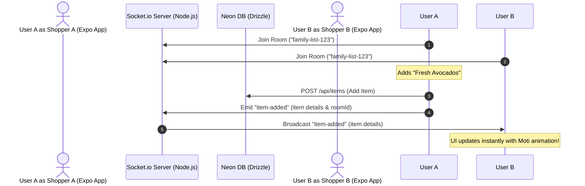

# Grocify — Real-Time Collaborative Shopping Lists 🚀

Welcome to **Grocify**, the smart grocery planner. This guide provides a complete, step-by-step technical blueprint to implement **Real-Time Collaborative Shopping Lists** using **Socket.io**, **Drizzle ORM (PostgreSQL)**, and **Zustand** state management in your Expo React Native app.

---



---

## 🛠️ Prerequisites & Installation

To build this feature, you will need to install the required packages on both the **Client (Expo)** and your **Backend (Node.js)**.

### 1. Client-Side (Expo) Installation
Run the following command in the root of your project:
```bash
npm install socket.io-client
```

### 2. Server-Side Installation
Inside your backend server directory (or a new `/server` folder), install:
```bash
npm install express socket.io cors dotenv
```

---

## 🗺️ Step-by-Step Implementation Guide

### Step 1: Database Schema & Migration
We need to associate each grocery item with a specific collaborative list or "room".

1. Open `src/lib/server/db/schema.js` and add a `roomId` column to `groceryItems`:
   ```javascript
   export const groceryItems = pgTable("grocery_items", {
       id: text("id").primaryKey(),
       name: text("name").notNull(),
       category: text("category").notNull(),
       quantity: integer("quantity").notNull().default(1),
       purchased: boolean("purchased").notNull().default(false),
       priority: text("priority").notNull().default("medium"),
       updated_at: bigint("updated_at", { mode: "number" }).notNull(),
       
       // Add this column to group items collaboratively:
       roomId: text("room_id").notNull().default("global_room"),
   });
   ```
2. Generate and push database changes:
   ```bash
   npm run db:push
   ```

---

### Step 2: Build the Socket.io Server (`server.js`)
Create a lightweight, robust real-time relay server. When a client performs an action, the server updates the database and broadcasts the change to everyone in the same room.

Create a file named `server.js` in a `/server` directory:
```javascript
const express = require('express');
const http = require('http');
const { Server } = require('socket.io');
const cors = require('cors');

const app = express();
app.use(cors());

const server = http.createServer(app);
const io = new Server(server, {
  cors: {
    origin: "*", // Adjust for production
    methods: ["GET", "POST"]
  }
});

io.on('connection', (socket) => {
  console.log(`🔌 Client connected: ${socket.id}`);

  // 1. Join Collaborative Room
  socket.on('join-room', (roomId) => {
    socket.join(roomId);
    console.log(`👥 Client ${socket.id} joined room: ${roomId}`);
  });

  // 2. Broadcast Item Added
  socket.on('item-added', ({ roomId, item }) => {
    socket.to(roomId).emit('item-added', item);
  });

  // 3. Broadcast Item Updated (e.g. quantity or purchased state)
  socket.on('item-updated', ({ roomId, item }) => {
    socket.to(roomId).emit('item-updated', item);
  });

  // 4. Broadcast Item Deleted
  socket.on('item-deleted', ({ roomId, itemId }) => {
    socket.to(roomId).emit('item-deleted', itemId);
  });

  socket.on('disconnect', () => {
    console.log(`❌ Client disconnected: ${socket.id}`);
  });
});

const PORT = process.env.PORT || 3000;
server.listen(PORT, () => {
  console.log(`🚀 Socket.io Server running on port ${PORT}`);
});
```

---

### Step 3: Set Up Client-Side Socket Wrapper
Create a utility to initialize and share the socket connection throughout your Expo React Native application.

Create `src/lib/socket.js`:
```javascript
import { io } from 'socket.io-client';

// Replace with your local machine's IP (not localhost) when testing on a physical device!
const SOCKET_URL = 'http://localhost:3000'; 

export const socket = io(SOCKET_URL, {
  autoConnect: false,
});

export const connectSocket = (roomId) => {
  if (!socket.connected) {
    socket.connect();
  }
  socket.emit('join-room', roomId);
};

export const disconnectSocket = () => {
  if (socket.connected) {
    socket.disconnect();
  }
};
```

---

### Step 4: Integrate Real-Time Sync into Zustand Store
Hook your Socket.io events directly into your Zustand store (`groceryStore`) so changes update your list instantly with full reactive bindings. This production-ready setup includes protection against duplicate listeners, handles store cleanup gracefully, and prevents duplicate rendering.

In your Zustand store setup (e.g., `src/store/groceryStore.js`):
```javascript
import { create } from 'zustand';
import { nanoid } from 'nanoid/non-secure';
import { socket } from '../lib/socket';

export const useGroceryStore = create((set, get) => {
  // Store listener references to prevent memory leaks and duplicates
  let handleItemAdded;
  let handleItemUpdated;
  let handleItemDeleted;

  return {
    items: [],
    roomId: null,

    // Create new room
    createRoom: () => {
      const roomId = nanoid();
      set({ roomId });
      socket.emit('join-room', roomId);
      return roomId;
    },

    // Join existing room
    joinRoom: (roomId) => {
      set({ roomId });
      socket.emit('join-room', roomId);
    },

    // Initialize socket listeners
    initSocketSync: () => {
      // Prevent duplicate listeners
      get().cleanupSocketSync();

      handleItemAdded = ({ item }) => {
        set((state) => {
          const exists = state.items.some(
            (i) => i.id === item.id
          );
          if (exists) return state;

          return {
            items: [...state.items, item],
          };
        });
      };

      handleItemUpdated = ({ item }) => {
        set((state) => ({
          items: state.items.map((i) =>
            i.id === item.id ? item : i
          ),
        }));
      };

      handleItemDeleted = ({ itemId }) => {
        set((state) => ({
          items: state.items.filter(
            (i) => i.id !== itemId
          ),
        }));
      };

      socket.on('item-added', handleItemAdded);
      socket.on('item-updated', handleItemUpdated);
      socket.on('item-deleted', handleItemDeleted);
    },

    // Cleanup listeners on unmount
    cleanupSocketSync: () => {
      if (handleItemAdded) {
        socket.off('item-added', handleItemAdded);
      }
      if (handleItemUpdated) {
        socket.off('item-updated', handleItemUpdated);
      }
      if (handleItemDeleted) {
        socket.off('item-deleted', handleItemDeleted);
      }
    },

    // Add item
    addItem: async (item) => {
      try {
        // Save to DB here...

        // Update local state immediately
        set((state) => ({
          items: [...state.items, item],
        }));

        // Emit socket event
        socket.emit('item-added', {
          roomId: get().roomId,
          item,
        });
      } catch (error) {
        console.log(error);
      }
    },

    // Toggle purchased
    togglePurchased: async (itemId) => {
      try {
        let updatedItem;

        set((state) => {
          const updatedItems = state.items.map((item) => {
            if (item.id === itemId) {
              updatedItem = {
                ...item,
                purchased: !item.purchased,
              };
              return updatedItem;
            }
            return item;
          });

          return {
            items: updatedItems,
          };
        });

        socket.emit('item-updated', {
          roomId: get().roomId,
          item: updatedItem,
        });
      } catch (error) {
        console.log(error);
      }
    },

    // Delete item
    deleteItem: async (itemId) => {
      try {
        set((state) => ({
          items: state.items.filter(
            (item) => item.id !== itemId
          ),
        }));

        socket.emit('item-deleted', {
          roomId: get().roomId,
          itemId,
        });
      } catch (error) {
        console.log(error);
      }
    },
  };
});
```

---

### Step 5: Screen Integration & Lifecycle Management
Bind the socket connection to the lifecycle of your primary list screen.

Inside your grocery list screen (e.g. `index.jsx` or `planner.jsx`):
```javascript
import React, { useEffect } from 'react';
import { connectSocket, disconnectSocket } from '../lib/socket';
import { useGroceryStore } from '../store/groceryStore';

export default function GroceryListScreen() {
  const { initSocketSync, cleanupSocketSync, roomId } = useGroceryStore();

  useEffect(() => {
    // 1. Establish connection and join room
    connectSocket(roomId);
    
    // 2. Start listening to socket changes
    initSocketSync();

    // 3. Clean up on screen unmount
    return () => {
      cleanupSocketSync();
      disconnectSocket();
    };
  }, [roomId]);

  return (
    // Your beautiful HSL/Glassmorphism rendered list component
  );
}
```

> [!TIP]
> **Dynamic Room Generation:** You can bind the `createRoom` action to a UI button (e.g., a "Create Shared List" or "Invite Roommates" button). When pressed, `createRoom()` will instantly generate a globally unique room ID, save it to your local Zustand state, and emit a `join-room` trigger to the socket server, preparing your list immediately for multi-user sync!

### 💡 UI Integration Example (Button & Sharing)
Below is a clean, modern React Native component demonstrating how to render a collaborative banner that binds to your store actions. It uses the native `Share` API so users can easily text or mail the unique room ID to partners or roommates:

```javascript
import React, { useState } from 'react';
import { View, Text, Pressable, Share, TextInput } from 'react-native';
import { useGroceryStore } from '../store/groceryStore';

export default function CollaborationHeader() {
  const { roomId, createRoom, joinRoom } = useGroceryStore();
  const [inputRoomId, setInputRoomId] = useState('');
  const [isJoining, setIsJoining] = useState(false);

  const handleShareList = async () => {
    try {
      await Share.share({
        message: `Join my collaborative shopping list on Grocify! Active Room ID: ${roomId}`,
      });
    } catch (error) {
      console.error(error.message);
    }
  };

  const handleJoinSubmit = () => {
    if (inputRoomId.trim()) {
      joinRoom(inputRoomId.trim());
      setInputRoomId('');
      setIsJoining(false);
    }
  };

  return (
    <View className="bg-card dark:bg-card p-4 rounded-3xl border border-border gap-4">
      {/* 1. Header & Info */}
      <View className="flex-row items-center justify-between">
        <View className="flex-1">
          <Text className="text-card-foreground font-bold text-lg">Collaborative Shopping</Text>
          <Text className="text-muted-foreground text-xs mt-0.5">
            {roomId ? `Active Room: ${roomId}` : 'Not sharing this list yet'}
          </Text>
        </View>

        {roomId && (
          <Pressable
            onPress={handleShareList}
            className="bg-primary px-4 py-2.5 rounded-2xl active:opacity-90 flex-row items-center gap-1.5"
          >
            <Text className="text-primary-foreground font-semibold text-sm">Invite Roommate</Text>
          </Pressable>
        )}
      </View>

      {/* 2. Join Input State */}
      {isJoining && !roomId && (
        <View className="flex-row items-center gap-2 border-t border-border/40 pt-3">
          <TextInput
            value={inputRoomId}
            onChangeText={setInputRoomId}
            placeholder="Paste active Room ID here"
            placeholderTextColor="#888"
            className="flex-1 border border-border rounded-2xl p-2.5 text-sm bg-muted text-foreground"
            autoCapitalize="none"
            autoCorrect={false}
          />
          <Pressable
            onPress={handleJoinSubmit}
            className="bg-primary px-4 py-2.5 rounded-2xl active:opacity-90"
            disabled={!inputRoomId.trim()}
          >
            <Text className="text-primary-foreground font-semibold text-sm">Submit</Text>
          </Pressable>
          <Pressable
            onPress={() => {
              setIsJoining(false);
              setInputRoomId('');
            }}
            className="bg-muted border border-border px-3 py-2.5 rounded-2xl active:opacity-90"
          >
            <Text className="text-muted-foreground font-semibold text-sm">Cancel</Text>
          </Pressable>
        </View>
      )}

      {/* 3. Non-Sharing Menu States */}
      {!roomId && !isJoining && (
        <View className="flex-row items-center gap-2 border-t border-border/40 pt-3">
          <Pressable
            onPress={createRoom}
            className="flex-1 bg-secondary py-3 rounded-2xl active:opacity-90 items-center"
          >
            <Text className="text-secondary-foreground font-semibold text-sm">Create Shared List</Text>
          </Pressable>

          <Pressable
            onPress={() => setIsJoining(true)}
            className="flex-1 bg-muted border border-border py-3 rounded-2xl active:opacity-90 items-center"
          >
            <Text className="text-muted-foreground font-semibold text-sm">Join Existing List</Text>
          </Pressable>
        </View>
      )}
    </View>
  );
}
```

---

## 🎨 Premium User Experience Enhancements
To achieve a **wow** aesthetic first-impression, consider implementing:

* **Moti Animations:** Wrap your list items in `<MotiView>` to animate items smoothly when they slide into view or fade out during a collaborative update.
* **Presence Bubbles:** Emit a `presence-update` event whenever a user connects/disconnects, showing dynamic shopper count/avatars in the top header.
* **Haptic Feedback (`expo-haptics`):** Trigger a subtle light vibration when another user marks an item as purchased, keeping the shopping list feeling responsive and tactile.
